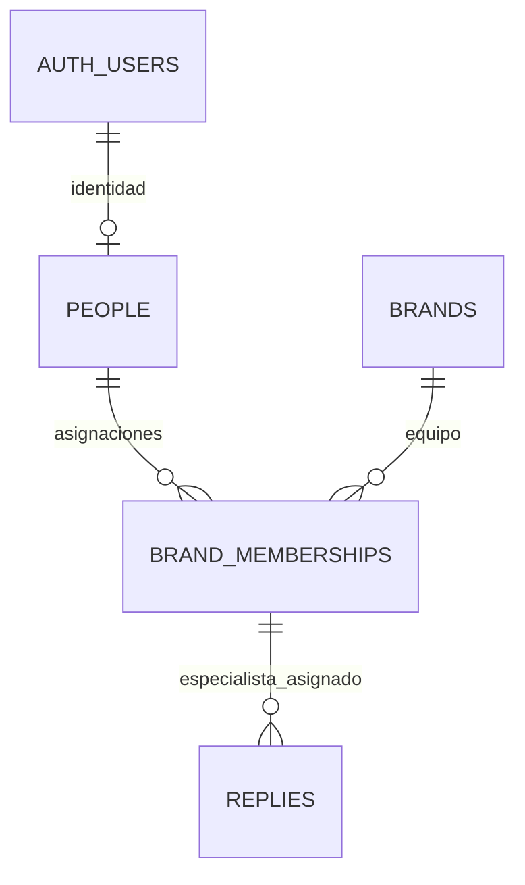

# Modelo de datos · P1 y P2

P1 se implementa con `20260925042000_core_entities.sql` y su corrección incremental `20260925151000_normalize_person_roles.sql`, integradas en `main` mediante PR #2. P2 añade `20260925152500_quality_criteria.sql` en `feat/quality-criteria`. Se conservan las migraciones publicadas y se actualizan bases existentes sin recrearlas.



| Tabla | Responsabilidad | Integridad |
| --- | --- | --- |
| `people` | Perfil del personal con identidad de Supabase Auth | `id = auth.users.id`; nombre obligatorio; rol `lead` o `specialist` |
| `brands` | Contexto para evaluar una respuesta | Slug único y normalizado, nombre, voz y procedimientos obligatorios |
| `brand_memberships` | Asignación de una persona a una marca | Clave `(person_id, brand_id)`; sin copia del rol |
| `replies` | Mensaje del cliente y respuesta ya enviada | Autor asignado como especialista a la marca; fecha con zona horaria; identidad de importación única |

## Decisiones y límites

La identidad en Auth no contiene las asignaciones. La membresía por marca será la base de autorización en P4; el rol global sirve como perfil y no concede acceso transversal.

**Normalización:** el rol existe únicamente en `people`. La versión inicial repetía `role` en `brand_memberships`: dado que `person_id → role`, dependía de una parte de la clave `(person_id, brand_id)` y violaba 2FN. La corrección elimina esa columna, `replies.specialist_role` y los dos índices únicos auxiliares para roles. Las pruebas de integridad anteriores no demostraban normalización.

Con las dependencias del dominio declaradas, las cuatro tablas quedan en 3FN: los atributos de perfil dependen de `people.id`; el contexto de marca depende de `brands.id` o su clave alternativa `slug`; la fecha de asignación depende del par persona/marca; y el contenido de respuesta depende de su `id` o de `(brand_id, source, external_id)`. No hay atributos del perfil o de la marca repetidos en respuestas. Las FK y los índices no son duplicación de atributos de negocio.

**Integridad del autor:** una FK compuesta `(specialist_id, brand_id)` exige la asignación. Un trigger comprueba `people.role = 'specialist'` al insertar o cambiar el autor. La función interna `private.check_reply_specialist` usa `SECURITY DEFINER`, `search_path = ''`, nombres cualificados y ningún permiso de ejecución para roles API; permite comprobar la regla incluso cuando RLS oculta el perfil al llamante. No expone datos ni forma parte del esquema API.

**Límite explícito de V1:** el rol queda fijo desde la creación del perfil, incluso sin respuestas; los cambios de nombre sí están permitidos. Un trigger sin privilegios elevados rechaza cambios de rol. El chequeo del autor bloquea su fila con `FOR KEY SHARE` para impedir una eliminación/recreación concurrente durante la inserción. La combinación de rol inmutable y bloqueo mantiene la integridad también con transacciones concurrentes. Promociones/cambios de rol requieren diseñar antes su historial; no se implementan en esta corrección.

**Importación futura:** `(brand_id, source, external_id)` es único. `external_id` identifica la respuesta/mensaje del helpdesk, no el ticket, que puede tener varias respuestas. El importador podrá usar ese conjunto como objetivo de `ON CONFLICT`; la migración no implementa un conector. P3 proporcionará IDs estables con `source = 'seed'`.

**Tiempo medido:** `sent_at` usa `timestamptz`; `first_response_minutes` admite un entero no negativo o NULL cuando la fuente no lo proporciona. No convertir un tiempo desconocido en cero.

**Historial:** las FK usan borrado restrictivo. Una baja de usuario, marca o asignación no elimina respuestas en cascada. Una asignación con respuestas no puede borrarse; el rol ya no pertenece a esa tabla. Antes de gestionar bajas o promociones habrá que incorporar archivo/historial.

**Seguridad inicial:** las cuatro tablas tienen RLS habilitado, ninguna política y privilegios revocados a `PUBLIC`, `anon` y `authenticated`. El acceso del cliente queda cerrado hasta P4. El rol de servicio conserva operaciones de datos para el seed; no puede usarse en requests. P1 no equivale a la autorización por rol terminada.

**Índices de P1:** cola por `(brand_id, sent_at DESC)`, respuestas por `specialist_id` y miembros por `brand_id`, además de claves y restricciones únicas. No hay enums ni vistas. P2 añade las comprobaciones internas descritas a continuación.

## P2 · Criterios y revisión

| Tabla | Dependencias y normalización | Reglas |
| --- | --- | --- |
| `issue_tags` | `id → brand_id, code, label, severity`; `(brand_id, code)` identifica también el criterio, considerando NULL como ámbito global | Severidad crítica/mayor/menor; `UNIQUE NULLS NOT DISTINCT` evita códigos globales duplicados |
| `reviews` | `id` y `reply_id` son claves alternativas; todos los atributos dependen de ellas | Una revisión por respuesta, puntaje entero 1–4, comentario obligatorio; marca derivada de `replies`, no almacenada |
| `review_tags` | Relación N:M con clave `(review_id, tag_id)`, sin atributos no clave | Sin duplicados ni copia de marca/severidad; etiqueta global o de la marca de la respuesta |
| `brand_changes` | `id → brand_id, author_id, happened_on, note` | Intervención fechada y nota obligatoria; autor líder asignado |

Con estas dependencias, P2 conserva 3FN. `code` no determina por sí solo la severidad: marcas diferentes pueden usar el mismo código con criterios distintos. Los promedios y conteos de críticos no se almacenan; se calcularán desde las revisiones y el catálogo. La normalización se razona a partir de dependencias; las pruebas comprueban restricciones, no constituyen por sí solas una demostración de 3FN.

**Integridad frente a autorización:** `private.check_quality_lead` comprueba al insertar que el revisor/autor sea un líder asignado a la marca; `private.check_review_tag_scope` valida las asociaciones tanto en INSERT como en UPDATE. Usan `SECURITY DEFINER`, `search_path = ''`, nombres cualificados y bloqueos `FOR KEY SHARE` de las filas consultadas. No conceden permisos al usuario ni comparan su sesión: P4 debe exigir `auth.uid()` y asignación vigente mediante RLS. Ninguna función interna tiene EXECUTE para roles API, incluido `service_role`.

**Identidad e historial en V1:** la marca de una respuesta, la respuesta/revisor/fecha original de una revisión y la marca/autor de una intervención quedan fijos. También quedan fijos el ámbito, código y severidad del criterio; para cambiar su significado se crea otro código, evitando reclasificar los errores históricos. Se permite corregir la redacción de las etiquetas. La inmutabilidad de estos campos y del rol de P1 evita que una actualización concurrente invalide las comprobaciones. La pertenencia del líder se verifica al crear el registro: una baja posterior de esa membresía conserva la autoría histórica. Los permisos futuros de edición dependen de la membresía vigente, no de esta validación histórica.

**Revisión editable:** puntaje, comentario e indicador de ejemplo pueden cambiar y un trigger mantiene `updated_at`. V1 conserva una revisión actual, no un historial de versiones. Borrar una respuesta con revisión o una etiqueta usada está prohibido. Borrar explícitamente una revisión elimina solo sus filas en `review_tags`, no la respuesta ni el catálogo. No existe una función pública para guardar: el guardado atómico de revisión y etiquetas queda para P6.

**Acceso e índices:** las cuatro tablas nuevas tienen RLS sin políticas y sin privilegios para `anon`/`authenticated`; `service_role` conserva CRUD para seed, sujeto a integridad. Índices sobre revisor, fecha de revisión, etiqueta de la relación, marca/fecha de intervención y autor complementan las PK/UNIQUE. No hay enums, vistas ni endpoints nuevos. P3 aportará datos creíbles; P4 abrirá solo los permisos necesarios.

## Verificación

```sh
npm run db:start
npx --no-install supabase migration up --local
npm run db:test
```

`migration up --local` aplica las migraciones pendientes sin borrar filas de negocio. Para recrear desde cero una base desechable existe `npm run db:reset`, que sí borra sus datos. Las pruebas usan fixtures dentro de una transacción y hacen rollback; no son el seed de demo ni crean cuentas utilizables. Comprueban asignaciones, roles, importación, protección del historial y cierre de acceso.

El ensayo de actualización se ejecuta **solo sobre el esquema P1 anterior a la corrección**, concatenando en una sesión psql con `ON_ERROR_STOP=1`: `scripts/sql/normalization_before.sql`, la migración nueva y `scripts/sql/normalization_after.sql`. Compara todas las filas de las cuatro tablas y revierte tanto fixtures como DDL al terminar. Está fuera de `supabase/tests/` porque no es una prueba pgTAP para el esquema final.

Verificación P2: **110 aserciones aprobadas** (48 de P1 y 62 de P2), migración incremental aplicada y lint SQL de `public,private` sin errores. P1 añade una comprobación separada de la FK de asignación porque P2 ahora rechaza antes el movimiento de una respuesta entre marcas. No se ejecutó `db reset` sobre los datos locales. Las pruebas no sustituyen las pruebas de autorización funcional que faltan en P4.

Referencias: [restricciones de PostgreSQL 17](https://www.postgresql.org/docs/17/ddl-constraints.html), [RLS en Supabase](https://supabase.com/docs/guides/database/postgres/row-level-security) y [pruebas locales](https://supabase.com/docs/guides/local-development/testing/overview).

## P3 · Datos de demostración

`scripts/seed.ts` escribe con la service role key y pasa por las mismas restricciones y triggers que cualquier escritura: autor especialista asignado, revisor líder asignado, etiqueta global o de la marca revisada. `external_id` sigue el patrón `<slug>-NNN` con `source = 'seed'`, de modo que un importador real (`source = 'helpdesk'`) no colisiona. Las revisiones fijan `created_at = updated_at` en el pasado para que las tendencias tengan historia; el trigger `touch_review` solo actúa en UPDATE.

## P4 · Autorización

`20260925170000_authorization.sql` abre el acceso solo mediante políticas. Tres helpers en `private` (`is_brand_member`, `is_brand_lead`, `shares_brand_with`) usan `SECURITY DEFINER`, `search_path = ''` y solo responden sobre `auth.uid()`; evitan la recursión de políticas sobre `brand_memberships`. `private` no está expuesto por PostgREST; `authenticated` recibe `USAGE` y `EXECUTE` solo sobre esos tres.

Privilegios: `SELECT` en las ocho tablas; `INSERT (reply_id, reviewer_id, score, comment, is_example)` y `UPDATE (score, comment, is_example)` en `reviews`; `INSERT/DELETE` en `review_tags`; `INSERT` de columnas de negocio en `brand_changes`. Sin borrado de revisiones, sin escritura de respuestas, marcas, asignaciones ni criterios desde la API. `anon` no tiene nada.

Las escrituras pasan dos capas: los triggers de P2 (líder asignado, etiqueta de la marca) se ejecutan antes y RLS exige además que el autor sea el usuario de la sesión y siga asignado. Retirar una asignación corta el acceso de inmediato; las revisiones históricas se conservan. Un colíder puede leer, pero no editar, las revisiones de otro líder de la misma marca.

## P5 · Cola y cobertura

`20260925190000_review_queue.sql` crea dos vistas con `security_invoker = true`, así que RLS de P4 sigue decidiendo qué filas existen. Además filtran por `private.is_brand_lead`, de modo que un especialista obtiene una cola vacía desde la base, no por ocultarla en la interfaz.

- `review_coverage`: una fila por marca y especialista asignado (parte de `brand_memberships`, así aparecen también quienes nunca han sido revisados). Días desde la última revisión *en esa marca*, respuestas sin revisar de los últimos 14 días y revisadas/total de 4 semanas. Revisar a alguien en una marca no oculta su hueco en otra.
- `review_queue`: respuestas sin revisión de los últimos 14 días, con la cobertura de su especialista para ordenar en SQL: `last_reviewed_at` ascendente con nulos primero y después `sent_at` ascendente.

Nada se almacena: las cifras salen de `replies` y `reviews` en cada lectura. `anon` no tiene privilegios sobre las vistas.

## P6 · Guardado atómico

`20260925200000_submit_review.sql` define `public.submit_review(p_reply_id, p_score, p_comment, p_is_example, p_tag_ids)`. Es `SECURITY INVOKER` con `search_path = ''`: las políticas de P4 aplican a ambas inserciones y los triggers de P2 siguen validando líder asignado y ámbito de etiquetas. No existe parámetro de revisor; se usa `auth.uid()`. Al ser una sola llamada, cualquier fallo (etiqueta de otra marca, duplicado, marca ajena, puntaje o comentario inválidos) revierte revisión y etiquetas. Etiquetas repetidas se guardan una vez; el comentario se recorta. `EXECUTE` solo para `authenticated`.

## P7 · Resumen de feedback

`20260925210000_review_summary.sql` crea `review_summary` (`security_invoker`): por marca y especialista, número de revisiones, promedio (2 decimales), revisiones con al menos un problema crítico y fecha de la última. El conteo de críticos usa `EXISTS` para que una revisión con varias etiquetas no pese más en el promedio (hay una prueba para ello). La vista no filtra por rol ni por especialista: un especialista recibe su fila por RLS, un líder las de su equipo. `anon` no tiene acceso.

## P8 · Evidencia por marca

`20260925220000_brand_overview.sql` añade tres vistas `security_invoker`, todas agrupadas por `brand_id` y filtradas por `private.is_brand_lead`:

- `brand_weekly_scores`: por semana ISO de **envío** (7 semanas): n, promedio y revisiones con problema crítico (con `EXISTS`, sin inflar el promedio).
- `brand_critical_reviews`: una fila por revisión y etiqueta crítica, con la respuesta afectada.
- `brand_issue_patterns`: problema × especialista en 6 semanas, con ocurrencias y **semanas distintas**; dos o más semanas es un patrón.

`brand_changes.author_id` pasa a `default auth.uid()` y se retira `INSERT (author_id)` a `authenticated`: el autor sale de la sesión igual que el revisor, y RLS sigue exigiendo líder asignado.
