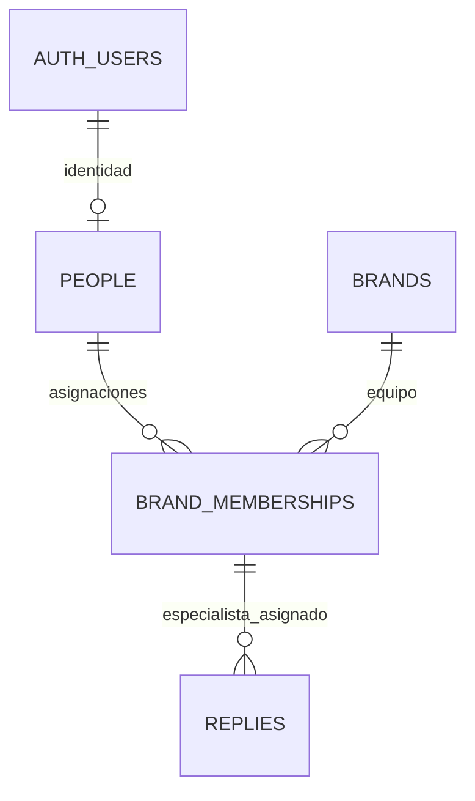

# P1 · Marcas, personas, asignaciones y respuestas

La migración `supabase/migrations/20260925042000_core_entities.sql` implementa P1. Las tablas de criterios y revisiones pertenecen a P2.



| Tabla | Responsabilidad | Integridad |
| --- | --- | --- |
| `people` | Perfil del personal con identidad de Supabase Auth | `id = auth.users.id`; nombre obligatorio; rol `lead` o `specialist` |
| `brands` | Contexto para evaluar una respuesta | Slug único y normalizado, nombre, voz y procedimientos obligatorios |
| `brand_memberships` | Asignación de una persona a una marca | Una asignación por persona/marca; rol consistente con `people` |
| `replies` | Mensaje del cliente y respuesta ya enviada | Autor asignado como especialista a la marca; fecha con zona horaria; identidad de importación única |

## Decisiones y límites

La identidad en Auth no contiene las asignaciones. La membresía por marca será la base de autorización en P4; el rol global sirve como perfil y no concede acceso transversal.

**Rol consistente en V1:** una persona es líder o especialista en todas sus asignaciones. Las claves foráneas compuestas impiden discrepancias. `replies.specialist_role` se genera siempre como `specialist`: es una columna técnica que permite comprobar la membresía correcta con una FK, incluyendo actualizaciones posteriores. No se acepta del formulario ni se requiere en el seed. El coste es un índice único adicional por relación; evita triggers y comprobaciones incompletas solo al insertar.

**Importación futura:** `(brand_id, source, external_id)` es único. `external_id` identifica la respuesta/mensaje del helpdesk, no el ticket, que puede tener varias respuestas. El importador podrá usar ese conjunto como objetivo de `ON CONFLICT`; la migración no implementa un conector. P3 proporcionará IDs estables con `source = 'seed'`.

**Tiempo medido:** `sent_at` usa `timestamptz`; `first_response_minutes` admite un entero no negativo o NULL cuando la fuente no lo proporciona. No convertir un tiempo desconocido en cero.

**Historial:** las FK usan borrado restrictivo. Una baja de usuario, marca o asignación no elimina respuestas en cascada. Una asignación con respuestas no puede borrarse ni cambiar de rol. Antes de gestionar bajas o promociones habrá que incorporar archivo/historial de asignaciones: no se oculta esta limitación de V1.

**Seguridad inicial:** las cuatro tablas tienen RLS habilitado, ninguna política y privilegios revocados a `PUBLIC`, `anon` y `authenticated`. El acceso del cliente queda cerrado hasta P4. El rol de servicio conserva operaciones de datos para el seed; no puede usarse en requests. P1 no equivale a la autorización por rol terminada.

**Índices:** cola por `(brand_id, sent_at DESC)`, respuestas por `specialist_id` y miembros por `brand_id`, además de las claves y restricciones únicas. No hay enums, vistas ni funciones con privilegios elevados.

## Verificación

```sh
npm run db:start
npm run db:reset
npm run db:test
```

`db:reset` recrea la base local desechable y borra sus datos: usar solo sobre el entorno local de desarrollo. Las pruebas usan fixtures dentro de una transacción y hacen rollback; no son el seed de demo ni crean cuentas utilizables. Comprueban asignaciones, roles, importación, protección del historial y cierre de acceso.

Referencias: [restricciones de PostgreSQL 17](https://www.postgresql.org/docs/17/ddl-constraints.html), [RLS en Supabase](https://supabase.com/docs/guides/database/postgres/row-level-security) y [pruebas locales](https://supabase.com/docs/guides/local-development/testing/overview).
