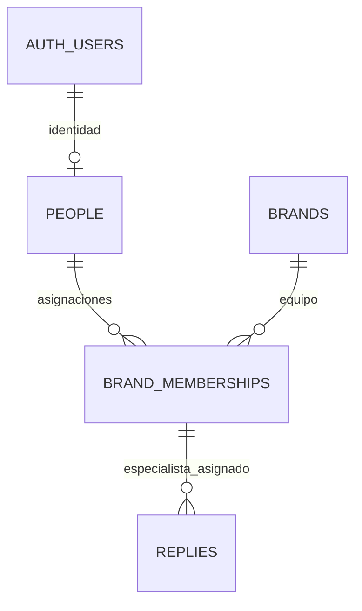

# P1 · Marcas, personas, asignaciones y respuestas

P1 se implementa con `20260925042000_core_entities.sql` y su corrección incremental `20260925151000_normalize_person_roles.sql`. Se conserva la migración publicada y se actualizan bases existentes sin recrearlas. Las tablas de criterios y revisiones pertenecen a P2, en una rama posterior independiente.



| Tabla | Responsabilidad | Integridad |
| --- | --- | --- |
| `people` | Perfil del personal con identidad de Supabase Auth | `id = auth.users.id`; nombre obligatorio; rol `lead` o `specialist` |
| `brands` | Contexto para evaluar una respuesta | Slug único y normalizado, nombre, voz y procedimientos obligatorios |
| `brand_memberships` | Asignación de una persona a una marca | Clave `(person_id, brand_id)`; sin copia del rol |
| `replies` | Mensaje del cliente y respuesta ya enviada | Autor asignado como especialista a la marca; fecha con zona horaria; identidad de importación única |

## Decisiones y límites

La identidad en Auth no contiene las asignaciones. La membresía por marca será la base de autorización en P4; el rol global sirve como perfil y no concede acceso transversal.

**Normalización:** el rol existe únicamente en `people`. La versión inicial repetía `role` en `brand_memberships`: dado que `person_id → role`, dependía de una parte de la clave `(person_id, brand_id)` y violaba 2FN. La corrección elimina esa columna, `replies.specialist_role` y los dos índices únicos auxiliares para roles. Las pruebas de integridad anteriores no demostraban normalización.

Con las dependencias del dominio declaradas, las cuatro tablas quedan en 3FN: los atributos de perfil dependen de `people.id`; el contexto de marca depende de `brands.id` o su clave alternativa `slug`; la fecha de asignación depende del par persona/marca; y el contenido de respuesta depende de su `id` o de `(brand_id, source, external_id)`. No hay atributos del perfil o de la marca repetidos en respuestas. Las FK y los índices no son duplicación de atributos de negocio.

**Integridad del autor:** una FK compuesta `(specialist_id, brand_id)` exige la asignación. Un trigger comprueba `people.role = 'specialist'` al insertar o cambiar el autor. La función interna `private.check_reply_specialist` usa `SECURITY DEFINER`, `search_path = ''`, nombres cualificados y ningún permiso de ejecución para roles API; permite comprobar la regla incluso cuando RLS oculta el perfil al llamante. No expone datos ni forma parte del esquema API.

**Límite explícito de V1:** el rol queda fijo desde la creación del perfil, incluso sin respuestas; los cambios de nombre sí están permitidos. Un trigger sin privilegios elevados rechaza cambios de rol. El chequeo del autor bloquea su fila con `FOR KEY SHARE` para impedir una eliminación/recreación concurrente durante la inserción. La combinación de rol inmutable y bloqueo mantiene la integridad también con transacciones concurrentes. Promociones/cambios de rol requieren diseñar antes su historial; no se implementan en esta corrección.

**Importación futura:** `(brand_id, source, external_id)` es único. `external_id` identifica la respuesta/mensaje del helpdesk, no el ticket, que puede tener varias respuestas. El importador podrá usar ese conjunto como objetivo de `ON CONFLICT`; la migración no implementa un conector. P3 proporcionará IDs estables con `source = 'seed'`.

**Tiempo medido:** `sent_at` usa `timestamptz`; `first_response_minutes` admite un entero no negativo o NULL cuando la fuente no lo proporciona. No convertir un tiempo desconocido en cero.

**Historial:** las FK usan borrado restrictivo. Una baja de usuario, marca o asignación no elimina respuestas en cascada. Una asignación con respuestas no puede borrarse; el rol ya no pertenece a esa tabla. Antes de gestionar bajas o promociones habrá que incorporar archivo/historial.

**Seguridad inicial:** las cuatro tablas tienen RLS habilitado, ninguna política y privilegios revocados a `PUBLIC`, `anon` y `authenticated`. El acceso del cliente queda cerrado hasta P4. El rol de servicio conserva operaciones de datos para el seed; no puede usarse en requests. P1 no equivale a la autorización por rol terminada.

**Índices:** cola por `(brand_id, sent_at DESC)`, respuestas por `specialist_id` y miembros por `brand_id`, además de claves y restricciones únicas. No hay enums ni vistas. La única función con privilegios elevados es la comprobación interna del autor descrita arriba.

## Verificación

```sh
npm run db:start
npx --no-install supabase migration up --local
npm run db:test
```

`migration up --local` aplica las migraciones pendientes sin borrar filas de negocio. Para recrear desde cero una base desechable existe `npm run db:reset`, que sí borra sus datos. Las pruebas usan fixtures dentro de una transacción y hacen rollback; no son el seed de demo ni crean cuentas utilizables. Comprueban asignaciones, roles, importación, protección del historial y cierre de acceso.

El ensayo de actualización se ejecuta **solo sobre el esquema P1 anterior a la corrección**, concatenando en una sesión psql con `ON_ERROR_STOP=1`: `scripts/sql/normalization_before.sql`, la migración nueva y `scripts/sql/normalization_after.sql`. Compara todas las filas de las cuatro tablas y revierte tanto fixtures como DDL al terminar. Está fuera de `supabase/tests/` porque no es una prueba pgTAP para el esquema final.

Referencias: [restricciones de PostgreSQL 17](https://www.postgresql.org/docs/17/ddl-constraints.html), [RLS en Supabase](https://supabase.com/docs/guides/database/postgres/row-level-security) y [pruebas locales](https://supabase.com/docs/guides/local-development/testing/overview).
